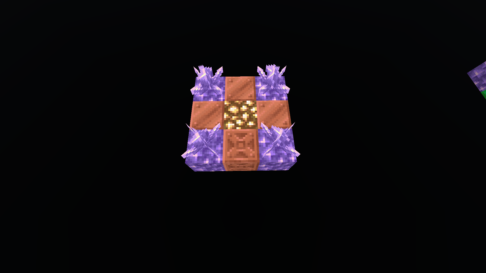
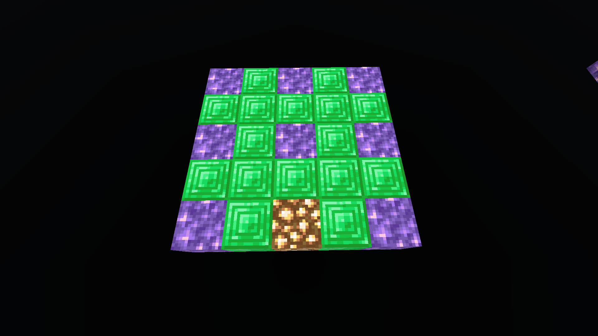
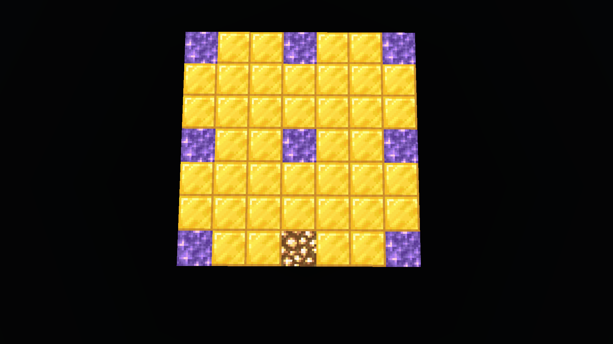
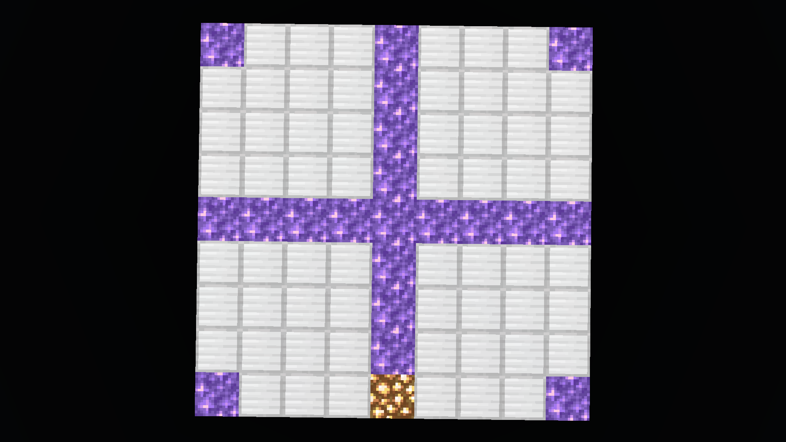

# CarpetSkyAdditions-Datapack

**Status:** In Development. Not ready for full use—testing phase ongoing.

## Overview
The `CarpetSkyAdditions-Datapack` is a custom Minecraft datapack designed to complement the [CarpetSkyAdditions-Reborn](https://github.com/TreeOfSelf/CarpetSkyAdditions-Reborn) Fabric mod for Minecraft 1.21.1. It introduces several new mechanics and tweaks to enhance skyblock gameplay by adding unique features, advancements, and interactions not covered by the mod alone.

## Installation
1. Disable the built-in datapack in the `CarpetSkyAdditions-Reborn` mod.
2. Enable and install this datapack.

## Features & Changes
### Incomplete or Under Development:
- **Breeze Spawning Mechanism:** This datapack is working now. Build the breeze 3x3 floor structure, stand one block south from the floor structure, then use fint and steel on the middle copper block. The trial spawner will appear, with a vault and ominous vault close by. There are a few things that needs a little bit of tweaking, but it doesn't stop the datapack functioning.

### Implemented Features:
- **Renewable Swift Sneak:** Added a loot table for librarians to drop a Swift Sneak book (level 1-3) when killed by a Warden. Disable CarpetSkyAdditions-Reborn non working function: /carpetskyadditions removeDefault renewableSwiftSneak
- **Sniffer Sand/Gravel Conversion:** carpetskyadditions_reborn crashes the game; The datapack sniffer_digging is now working. Implementing the 10% chance for turning sand/gravel to the suspicous variant proved to be hard. Anyone have a solution for this? Disable CarpetSkyAdditions-Reborn non working function: /carpetskyadditions removeDefault suspiciousSniffers
- **Vex to Allay Transformation:** In carpetskyadditions_reborn vex to allay seems to be broken. Here is a different approach. Build the vex sacrificial structure, bring the vex to the top of the structure,on the glowstone in the middle, then stand on the chiseled copper block. Use a amethyst shard and hit the vex. If everything is ok, the vex will turn inta an allay. The structure is directional. The glowstone stairs need to point toward the south. When the player stand on the chiseled copper block and look at the vex, the player should be facing north. Disable  CarpetSkyAdditions-Reborn non working function: /carpetskyadditions removeDefault allayableVexes

- **Wandering Trader Spawns With Camel** When wandering trader spawns in a desert biome, the wandering trader will spawn with a camel. Disable CarpetSkyAdditions-Reborn non working function: /carpetskyadditions removeDefault traderCamels
- **Modified Piglin Bartering:** Adjusted loot tables to ensure enchanted books from piglin bartering are only Soul Speed books (level 1-3).
- **Light Source Advancement:** Updated the light source achievement to include all copper bulb variants (67 total).
- **Spyglass all animals Advancement:** Included armadillos, raising the total number of animals to 40.
- **Spider Conversion Advancement:** Fixed the cave spider kill triggering issue for achievement.
- **Minor Script Fixes:** Adjusted scripts for stability and compatibility.

### New Additions:
- **Testing Functions:**
  - `remove_vaults`: Deletes blocks in a specific radius to aid in trial chamber testing.
- **Breeze Drops:** Added a chance for breezes to drop pottery sherds found in trial chambers.
- **Trial Chamber Music Disks:** Skeletons killing creepers in trial chambers' bounding boxes now drop three music disks.
- **Armor Trim Challenges:** Added challenges for obtaining the bolt and flow armor trim smithing templates.

## Notes
- This datapack includes manual functions and potential testing-only scripts that may not be suitable for regular gameplay yet.

## Future Work
Continued development and testing are ongoing to implement, refine, and stabilize all planned features.

## Credits
- Original `CarpetSkyAdditions` by [jsorrell](https://github.com/jsorrell/CarpetSkyAdditions).
- Continued development and enhancements by [TreeOfSelf](https://github.com/TreeOfSelf/CarpetSkyAdditions-Reborn).

This project builds upon and integrates with these works to provide an enriched skyblock experience in Minecraft 1.21.1.
